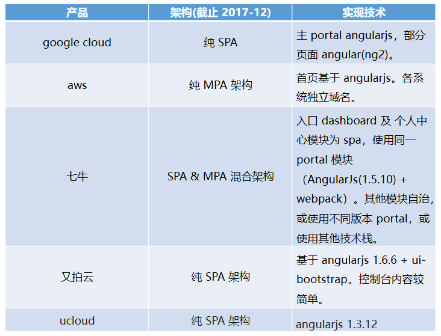
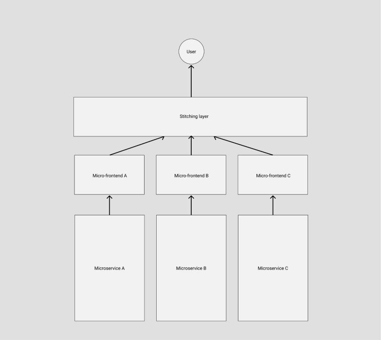
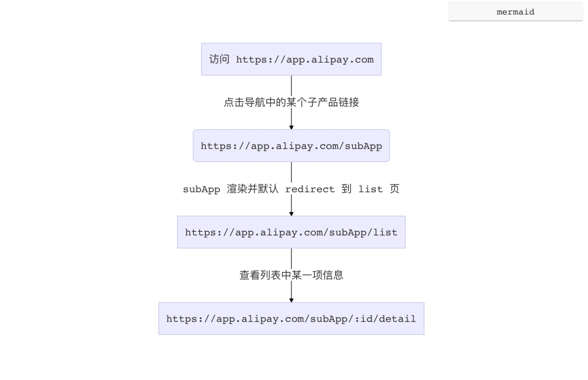
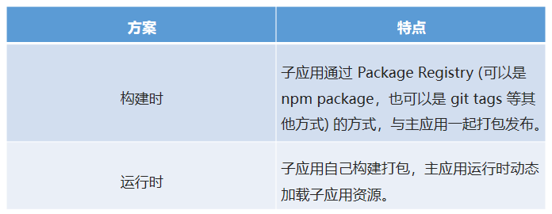
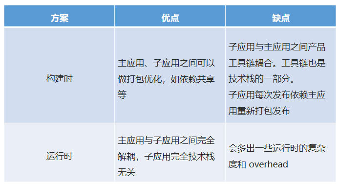
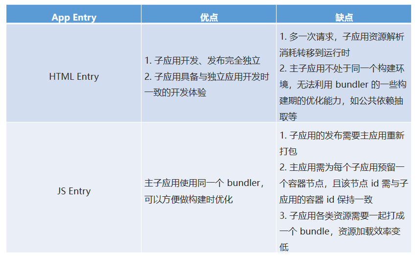
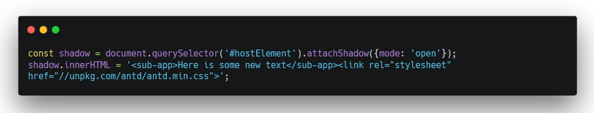

# 前端微服务

微前端架构是一种类似于微服务的架构，它将微服务的理念应用于浏览器端，即将 Web 应用由单一的单体应用转变为多个小型前端应用聚合为一的应用。
由此带来的变化是，这些前端应用可以独立运行、独立开发、独立部署。以及，它们应该可以在共享组件的同时进行并行开发——这些组件可以通过 NPM 或者 Git Tag、Git Submodule 来管理。

## 微前端的价值
****
微前端架构具备以下几个核心价值：

1. 技术栈无关：主框架不限制接入应用的技术栈，子应用具备完全自主权

2. 独立开发、独立部署：子应用仓库独立，前后端可独立开发，部署完成后主框架自动完成同步更新

3. 独立运行时：每个子应用之间状态隔离，运行时状态不共享

微前端架构旨在解决单体应用在一个相对长的时间跨度下，由于参与的人员、团队的增多、变迁，从一个普通应用演变成一个巨石应用( Frontend Monolith )后，随之而来的应用不可维护的问题。这类问题在企业级 Web 应用中尤其常见。

## 微前端架构一般可以由以下几种方式进行：
****

1. 使用 HTTP 服务器的路由来重定向多个应用

2. 在不同的框架之上设计通讯、加载机制，诸如 Mooa 和 Single-SPA

3. 通过组合多个独立应用、组件来构建一个单体应用

4. iFrame。使用 iFrame 及自定义消息传递机制

5. Web Components 构建应用

## 行业现状
****



* MPA 方案的优点在于 部署简单、各应用之间硬隔离，天生具备技术栈无关、独立开发、独立部署的特性。缺点则也很明显，应用之间切换会造成浏览器重刷，由于产品域名之间相互跳转，流程体验上会存在断点。

* SPA 则天生具备体验上的优势，应用直接无刷新切换，能极大的保证多产品之间流程操作串联时的流程性。缺点则在于各应用技术栈之间是强耦合的。

## 蚂蚁金服 乾坤 实践方案
****



### 1. 路由


lazy load 问题：
****
由于我们的子应用都是 lazy load 的，当浏览器重新刷新时，主框架的资源会被重新加载，同时异步 load 子应用的静态资源，由于此时主应用的路由系统已经激活，但子应用的资源可能还没有完全加载完毕，从而导致路由注册表里发现没有能匹配子应用 /subApp/123/detail 的规则，这时候就会导致跳 NotFound 页或者直接路由报错。

这个问题在所有 lazy load 方式加载子应用的方案中都会碰到，早些年前 angularjs 社区把这个问题统一称之为 Future State。

解决思路：
****
主框架配置子应用的路由为subApp: { url: '/subApp/**', entry:'./subApp.js' }，则当浏览器的地址为 /subApp/abc 时，框架需要先加载 entry 资源，待 entry 资源加载完毕，确保子应用的路由系统注册进主框架之后后，再去由子应用的路由系统接管 url change 事件。同时在子应用路由切出时，主框架需要触发相应的destroy 事件，子应用在监听到该事件时，调用自己的卸载方法卸载应用，如 React 场景下 destroy = () => ReactDOM.unmountAtNode(container) 。

要实现这样一套机制，我们可以自己去劫持 url change 事件从而实现自己的路由系统，也可以基于社区已有的 ui router library，尤其是 react-router 在 v4 之后实现了 Dynamic Routing 能力，我们只需要复写一部分路由发现的逻辑即可。这里我们推荐直接选择社区比较完善的相关实践single-spa。

### 2. App Entry
****
解决了路由问题后，主框架与子应用集成的方式，也会成为一个需要重点关注的技术决策。

* 构建是组合 VS 运行时组合


* 两者优缺点比较  


### 3. JSEntry VS HTMLEntery
****
在确定了运行时载入的方案后，另一个需要决策的点是，我们需要子应用提供什么形式的资源作为渲染入口？

JS Entry 的方式通常是子应用将资源打成一个entry script，比如 single-spa 的 example 中的方式。但这个方案的限制也颇多，如要求子应用的所有资源打包到一个 js bundle 里，包括 css、图片等资源。除了打出来的包可能体积庞大之外的问题之外，资源的并行加载等特性也无法利用上。

HTML Entry 则更加灵活，直接将子应用打出来 HTML作为入口，主框架可以通过 fetch html 的方式获取子应用的静态资源，同时将 HTML document 作为子节点塞到主框架的容器中。这样不仅可以极大的减少主应用的接入成本，子应用的开发方式及打包方式基本上也不需要调整，而且可以天然的解决子应用之间样式隔离的问题(后面提到)



### 4. 模块导入
****
微前端架构下，我们需要获取到子应用暴露出的一些钩子引用，如 bootstrap、mount、unmout 等(参考 single-spa)，从而能对接入应用有一个完整的生命周期控制。而由于子应用通常又有集成部署、独立部署两种模式同时支持的需求，使得我们只能选择 umd 这种兼容性的模块格式打包我们的子应用。如何在浏览器运行时获取远程脚本中导出的模块引用也是一个需要解决的问题。

通常我们第一反应的解法，也是最简单的解法就是与子应用与主框架之间约定好一个全局变量，把导出的钩子引用挂载到这个全局变量上，然后主应用从这里面取生命周期函数。

这个方案很好用，但是最大的问题是，主应用与子应用之间存在一种强约定的打包协议。那我们是否能找出一种松耦合的解决方案呢？

很简单，我们只需要走 umd 包格式中的 global export 方式获取子应用的导出即可，大体的思路是通过给 window变量打标记，记住每次最后添加的全局变量，这个变量一般就是应用 export 后挂载到 global 上的变量。实现方式可以参考 systemjs global import，这里不再赘述。
```
output: {
  library: `${packageName}-[name]`,
  libraryTarget: 'umd',
  jsonpFunction: `webpackJsonp_${packageName}`,
}
```

#### 5. 应用隔离
****
微前端架构方案中有两个非常关键的问题，有没有解决这两个问题将直接标志你的方案是否真的生产可用。比较遗憾的是此前社区在这个问题上的处理都会不约而同选择”绕道“的方式，比如通过主子应用之间的一些默认约定去规避冲突。而今天我们会尝试从纯技术角度，更智能的解决应用之间可能冲突的问题。

* ### 样式隔离

由于微前端场景下，不同技术栈的子应用会被集成到同一个运行时中，所以我们必须在框架层确保各个子应用之间不会出现样式互相干扰的问题。

Shadow DOM？

针对 "Isolated Styles" 这个问题，如果不考虑浏览器兼容性，通常第一个浮现到我们脑海里的方案会是 Web Components。基于 Web Components 的 Shadow DOM 能力，我们可以将每个子应用包裹到一个 Shadow DOM 中，保证其运行时的样式的绝对隔离。



由于子应用的样式作用域仅在 shadow 元素下，那么一旦子应用中出现运行时越界跑到外面构建 DOM 的场景，必定会导致构建出来的 DOM 无法应用子应用的样式的情况。

比如 sub-app 里调用了antd modal 组件，由于 modal 是动态挂载到document.body 的，而由于 Shadow DOM 的特性 antd 的样式只会在 shadow 这个作用域下生效，结果就是弹出框无法应用到 antd 的样式。解决的办法是把 antd 样式上浮一层，丢到主文档里，但这么做意味着子应用的样式直接泄露到主文档了。

* CSS Module? BEM?

社区通常的实践是通过约定 css 前缀的方式来避免样式冲突，即各个子应用使用特定的前缀来命名 class，或者直接基于 css module 方案写样式。对于一个全新的项目，这样当然是可行，但是通常微前端架构更多的目标是解决存量/遗产 应用的接入问题。很显然遗产应用通常是很难有动力做大幅改造的。

最主要的是，约定的方式有一个无法解决的问题，假如子应用中使用了三方的组件库，三方库在写入了大量的全局样式的同时又不支持定制化前缀？比如 a 应用引入了 antd 2.x，而b 应用引入了 antd 3.x，两个版本的 antd 都写入了全局的 .menu class ，但又彼此不兼容怎么办？

* Dynamic Stylesheet !

解决方案其实很简单，我们只需要在应用切出/卸载后，同时卸载掉其样式表即可，原理是浏览器会对所有的样式表的插入、移除做整个 CSSOM 的重构，从而达到 插入、卸载 样式的目的。这样即能保证，在一个时间点里，只有一个应用的样式表是生效的。

上文提到的 HTML Entry 方案则天生具备样式隔离的特性，因为应用卸载后会直接移除去 HTML 结构，从而自动移除了其样式表。


比如 HTML Entry 模式下，子应用加载完成的后的 DOM 结构,当子应用被替换或卸载时，subApp节点的innerHTML 也会被复写，//alipay.com/subapp.css 也就自然被移除样式也随之卸载了。

* ### JS隔离

解决了样式隔离的问题后，有一个更关键的问题我们还没有解决：如何确保各个子应用之间的全局变量不会互相干扰，从而保证每个子应用之间的软隔离？

这个问题比样式隔离的问题更棘手，社区的普遍玩法是给一些全局副作用加各种前缀从而避免冲突。但其实我们都明白，这种通过团队间的“口头”约定的方式往往低效且易碎，所有依赖人为约束的方案都很难避免由于人的疏忽导致的线上 bug。那么我们是否有可能打造出一个好用的且完全无约束的 JS 隔离方案呢？

针对 JS 隔离的问题，我们独创了一个运行时的 JS 沙箱。简单画了个架构图：


即在应用的 bootstrap 及 mount 两个生命周期开始之前分别给全局状态打下快照，然后当应用切出/卸载时，将状态回滚至 bootstrap 开始之前的阶段，确保应用对全局状态的污染全部清零。而当应用二次进入时则再恢复至 mount 前的状态的，从而确保应用在 remount 时拥有跟第一次 mount 时一致的全局上下文。

当然沙箱里做的事情还远不止这些，其他的还包括一些对全局事件监听的劫持等，以确保应用在切出之后，对全局事件的监听能得到完整的卸载，同时也会在 remount 时重新监听这些全局事件，从而模拟出与应用独立运行时一致的沙箱环境。

* 蚂蚁金服乾坤

[https://github.com/umijs/qiankun](https://github.com/umijs/qiankun)


# 参考链接
[https://tech.antfin.com/community/articles/536](https://tech.antfin.com/community/articles/536)

[https://mp.weixin.qq.com/s?__biz=MjM5Mjg4NDMwMA==&mid=2652975949&idx=1&sn=c36387188283dd4fae52257357541729&chksm=bd4ae06e8a3d6978e2645848217ae8324ae83a07a410441dda8b7d7e7b4a8374d5e6c88fb7a2&scene=21#wechat_redirect](https://mp.weixin.qq.com/s?__biz=MjM5Mjg4NDMwMA==&mid=2652975949&idx=1&sn=c36387188283dd4fae52257357541729&chksm=bd4ae06e8a3d6978e2645848217ae8324ae83a07a410441dda8b7d7e7b4a8374d5e6c88fb7a2&scene=21#wechat_redirect)

